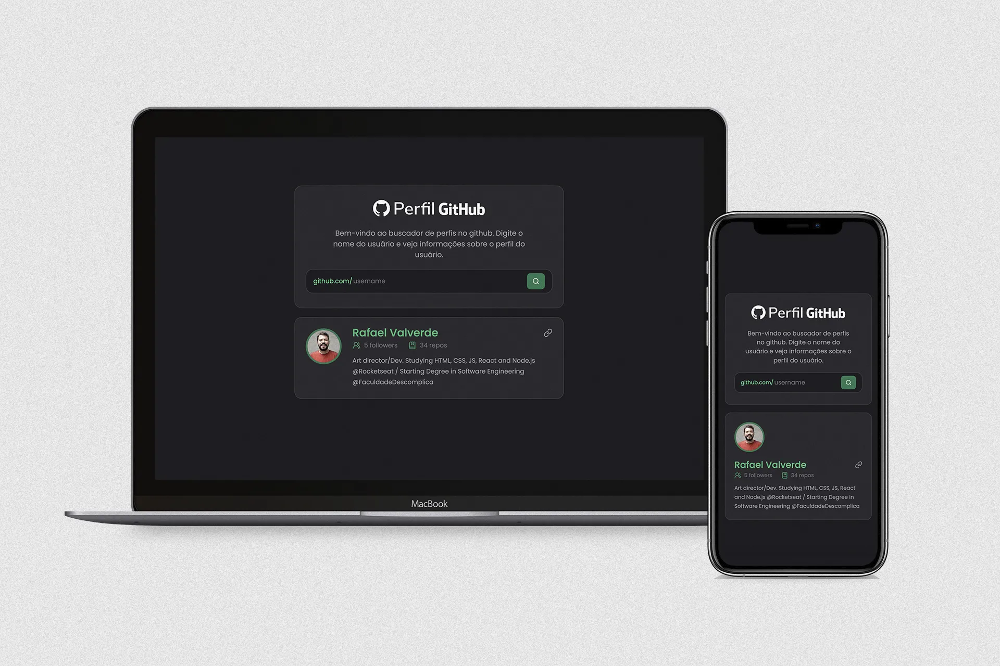

# Teste Técnico Avanti Innovation Class

## Busca de perfil no Github

Projeto realizado em teste técnico para vaga de estágio na Avanti Digital Commerce Expert, no programa Avanti Innovation Class, criando um buscador de perfil do Github que busca na API e exibe informações do usuário.

## Screenshots

## Resultado

Você pode acessar o resultado clicando [aqui](https://avantigithubprofile.netlify.app/).

### Requisitos atendidos

- Desenvolver uma aplicação React que permite buscar perfis do GitHub e exibir informações do usuário conforme o layout do Figma abaixo. [Layout proposto](https://www.figma.com/proto/DqtFxC6312M32mLt8FpJjq/inovation-class?page-id=22%3A2864&node-id=22-4293&viewport=359%2C115%2C0.25&t=SHsEqEgaMrXGMKwv-1&scaling=scale-down-width&content-scaling=fixed&starting-point-node-id=22%3A4293&show-proto-sidebar=1)
- Criar um campo de busca, onde o usuário digita o nome de um perfil do GitHub.
- Ao clicar no botão de busca, a aplicação deve consumir a API do GitHub e exibir as seguintes informações do usuário.
- Exibir mensagens de erro caso o perfil não seja encontrado
- Estilizar o layout seguindo o design do Figma. O candidato pode utilizar um framework CSS como Bootstrap, Tailwind ou outro.
- Melhorar a experiência do usuário com efeitos visuais e loading durante a requisição.

## Stack utilizada

**Front-end:** React.js • TailwindCSS

**Libs** React Hook Form, Zod, shadcn/ui, axios

## Autores

- [@rafaverde](https://www.github.com/rafaverde)

## Feedback

Se você tiver algum feedback, por favor me mande um [email](mailto:rafaverde@msn.com).

## Licença

[MIT](https://choosealicense.com/licenses/mit/)
